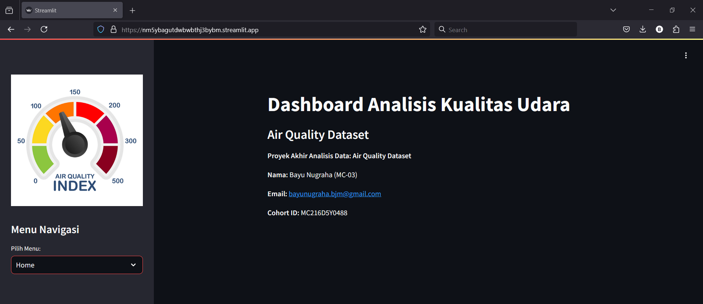

# Final Project Analisis Data

## Project installation

Here are the steps to set up your virtual environment for this project:

1. Clone this repository

   ```
   git clone https://github.com/bayunimous/Proyek-Analisis-Air-Quality.git
   ```

2. Navigate to the Proyek Analisis Air Quality/ directory
   ```
   cd Proyek Analisis Air Quality
   ```
3. Launch the Streamlit app
   ```
   streamlit run dashboard.py
   ```
4. Stop the application by pressing `ctrl + c`.

## Dataset: Air Quality

[Air Quality Dataset](https://github.com/marceloreis/HTI/tree/master)

## Streamlit Cloud :

Streamlit Cloud : (https://nm5ybagutdwbwbthj3bybm.streamlit.app/)



## Setup environment

- Install Visual Studio Code as your editor
- Run the following command in the command line (preferably as an administrator)

```
pip install numpy pandas scipy matplotlib seaborn jupyter
```
